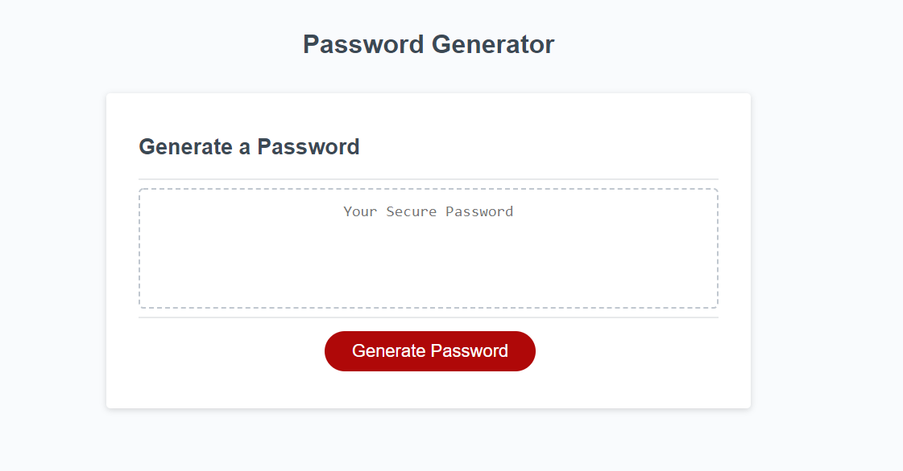
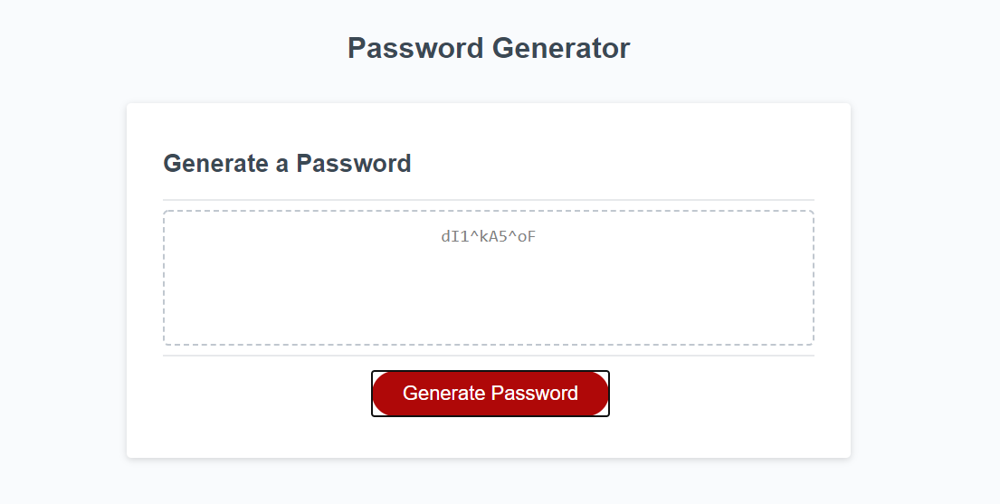
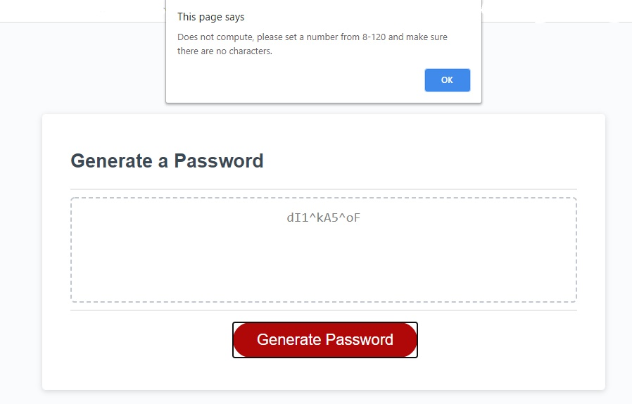
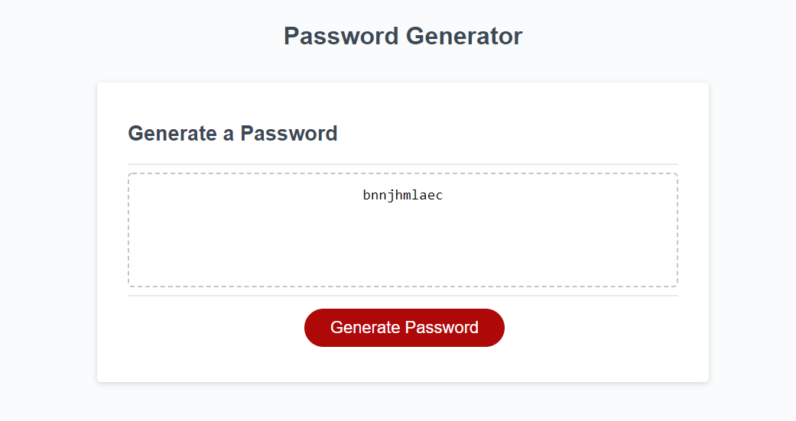
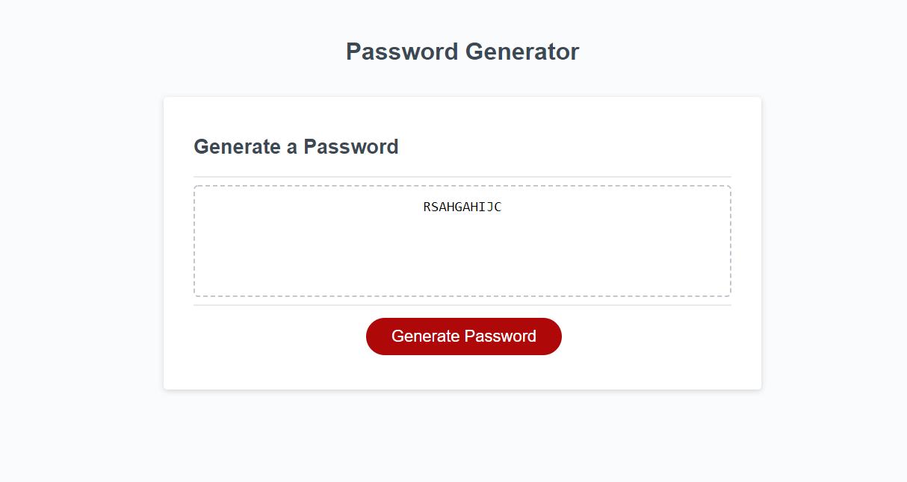
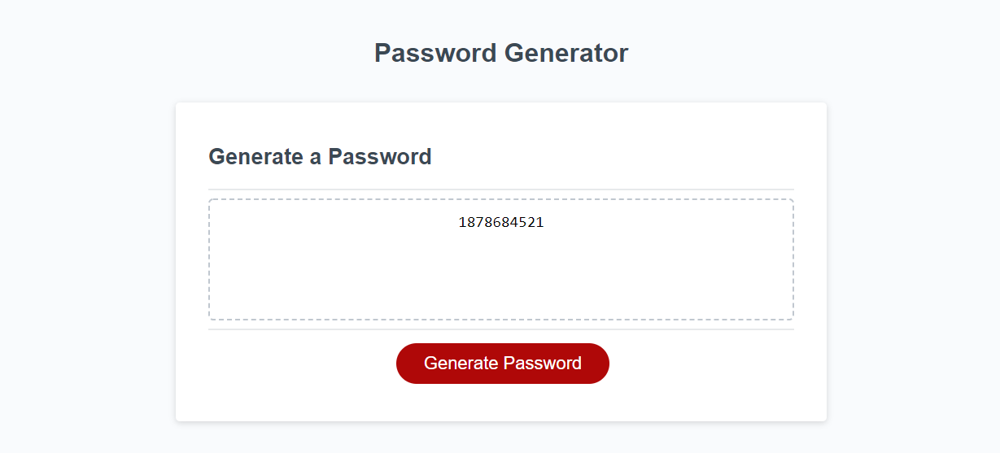
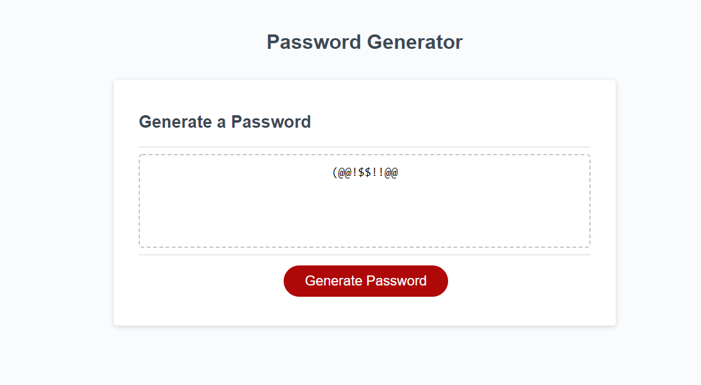

# HW3
Password Generator made with Javascript

## Assignment

Goal is to make a password generator with JavaScript.
* Must allow the user to choose character types
    * Uppercase
    * Lowercase
    * Numbers
    * Special Characters
* Button must activate the alert tabs to choose the character types.
* Should Output the password from the text box.

## How it works

When you first start up the site, you will be greeted with a giant box that allows you to generate the password. Click the button to get started.

Once you click on "Generate Password" you will see different segments that allows you to choose which character types you want to have on your randomized password.
The picture above shows all character types used to generate password. (Lowercase, Uppercase, Special Character, and Numbers)

If you have exceeded or go under the limit, the alert will pop up saying that you have to meet the certain criteria in order to generate the code. This will also popup if
you leave the character number tab or have it blank. **Note: If you have already generated the code from last time the text box will revert back to its startup text**

## Different Characters in Action

To prove that user can choose different character types, pictures are below.

**Lowercase only Password**

**Capital Letters only Password**

**Numbers only Password**

**Special Characters only**

